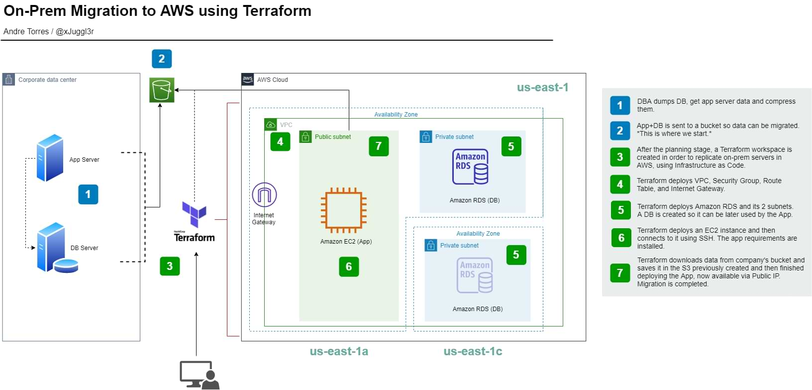

# Migration to AWS using Terraform

## IaC provisioned: VNC, EC2, RDS
<br/>



<br/>

### Why and How
<br/>
Why: A company is migrating to AWS. It needs to migrate an App and its database from its on-prem server.

<br/><br/>
How: Instead of manually creating all the infrastructure and config the servers in the tediously and dangerously way, a better alternative is to automate the task using Terraform.
<br/><br/>
What it does:
<br/>  
- Creates a VNC, SG, IG, RT <br/>
- Creates a RDS and its 2 subnets <br/>
- Creates an EC2 instance <br/>
- Connects to EC2 and downloads the App requirements <br/>
- Creates an S3 bucket <br/>
- Copy on-prem data from source to S3 <br/>
- Downloads the remaining data and deploys the App <br/>
- App accessible through Public IP <br/>


USAGE:

1 - Create a `secret.tfvars` and add to it:


```Terraform
ssh_cidr_blocks = ["0.0.0.0/0"] // ← allowed SSH connection
db_name = "<your-db-name>"
db_username = "<your-db-username>"
db_password = "<your-db-passord>"
```

Run 
```Terraform
terraform init
terraform plan -var-file="secret.tfvars"
terraform apply -var-file="secret.tfvars"
```


2 - Copy your `~/.aws/credentials` and `~/.aws/config`to the project root. Don't worry, they wont be uploaded to your Git Repo.

3 - Create afile `dbpass` with your db passwordon it. Don't worry, it wont be uploaded to your Git Repo.

4 - Run
```Terraform
terraform init
terraform validate
terraform plan -var-file="secret.tfvars"
terraform apply -var-file="secret.tfvars"
```

Wait some minutes and be happy
